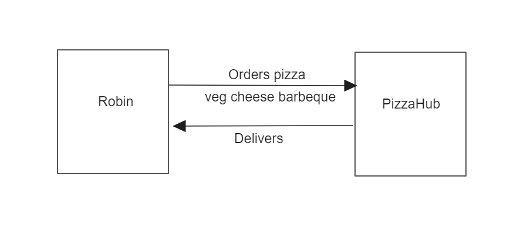

# Callback 

   Callback is a function which is to be executed after another function has finished execution. - Great notification mechanism.

   example:


   ```
   // Robin's end on clicking order pizza button
   orderPizza("veg", "cheese barbeque", (msg) => console.log(msg));

   // PizzaHub's end

   const orderPizza = (type, name, callback) => {
      console.log(`Pizza ${type} ${name} is ordered!`);

      setTimeout(() => {
         const msg = `Pizza ${type} ${name} is ready!!!`;
         callback(msg);
      }, 3000);
   }
   
   Output:
   Pizza veg cheese barbeque is ordered!

   (after 3 secs)
   Pizza veg cheese barbeque is ready!!!

   ```