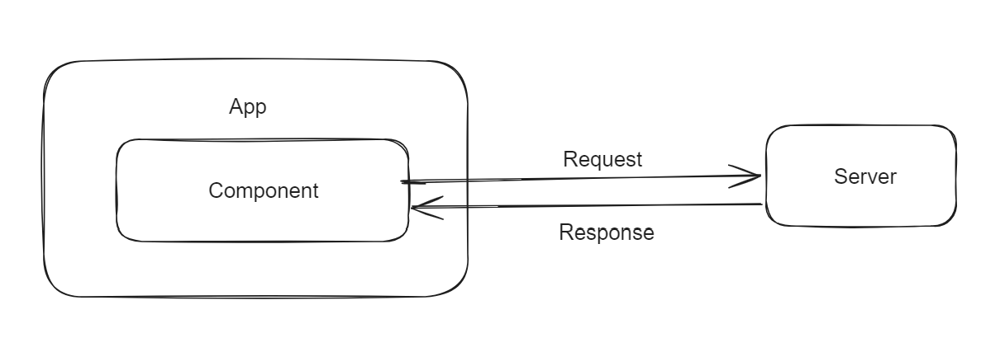
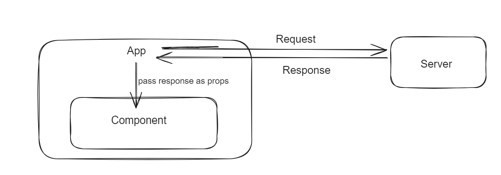
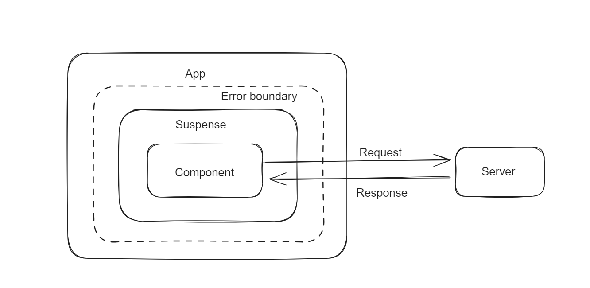

# Front-end-roadmap

This repository is for learning the Front-end concepts.

# 1. Concurrent React

- What is Concurrent React?

Its new behind-the-scenes mechanism that enables React to prepare multiple versions of your UI at the same time.

A key property of Concurrent React is that rendering is interruptible. This is introduced in React v18.0.0, before this version updates are rendered in a single, uninterrupted, synchronous transaction. With synchronous rendering, once the updates starts rendering, nothing can interrupt until the user see the results on the screen.

In a concurrent render, this was not always the case. React may start rendering an update, stops it in the middle ,then continue later. it may even abandon an in-progress render altogether. React guarantees that the UI will appear consistent even if a render is interrupted.To do this, it waits to perform DOM mutations until the end, once the entire tree has been evalutated. With this capability, React can prepare new screens in the background without blocking the main thread. This means UI can respond immediately to the user inputs even if it is in the middle of large rendering task,creating a fluid user experience.

Another example is reusable state. Concurrent React can remove the sections of the UI from the screen, then add them back later while reusing the previous state. For example, when the user tabs away from the screen and back, React should be able to restore the previous screen in the same state as it was in before.

# 2. React Suspense

Before deep diving into React Suspense lets know about Data fetching patterns

- Data fetching patterns
 a. Fetch on Render:
    This is most used way of data fetching.
    

 Problem: Consider parent and child components makes network calls on mounting phase, if the network call in the parent component fails during the component mount, it never allows the child component to render( Network waterfall ).

 b. Fetch then Render:
    
    Here we solve Network waterfall issue.

    Problem: Consider if the Parent component makes multiple network calls, children components render will wait till all the network calls to be resolved.

 c. Render while fetch: React Suspense.
    Before getting into the React Suspense lets understand what is Imperative and Declarive Programing.

    Imperative: You tell what needs to be done and how it needs to be done.
     example: Java, C, Pascal etc..
    
    Declarative: You tell the program that what needs to be done in declarative way and the program will take care of it.
     example: React - you dont need to worry about DOM manipulations. React Suspense is another example, ML
    
    React Suspense:
        a. We dont need to matain loading state.
        b. We dont need to make network call on the component mount using useEffect.
        
    Syntax:
    ```
        <Suspense fallback={<p> Loading... </p>}>
         <YourComponent/>
        </Suspense>
    ```
    Suspense will show the "Loading..." on the UI till the YourComponent network calls get resolved. Once it is resolved it will show the corresponding response(depending on the how you are rendering in YourComponent).

    Error boundary:
     In the above code snippet if the network call of the YourComponent fails with the error, to display any error response, we can use the Error boundary.

     We can have a generic error page cin the project and use it to display when network calls fails or throws error.

     We can use 3rd party library "react-error-boundary" in the project to do the same.

     Suspense will always reach out to the nearer error boundary when the component's network fails or throws error.
