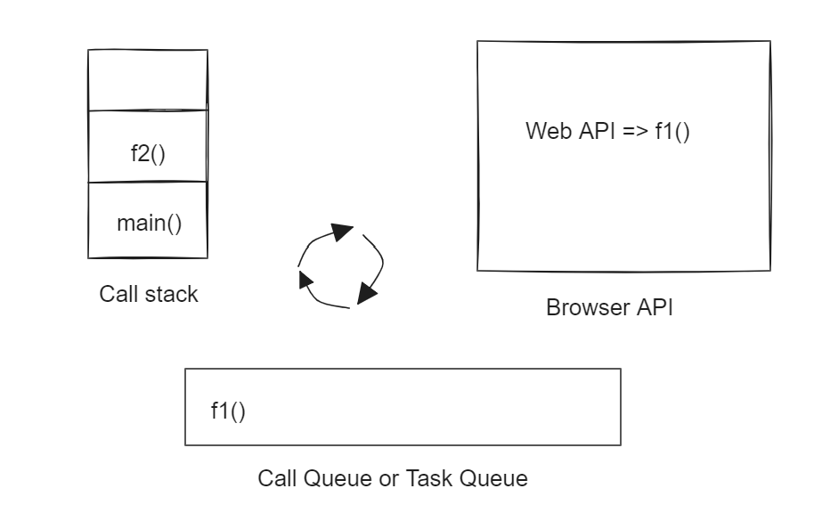
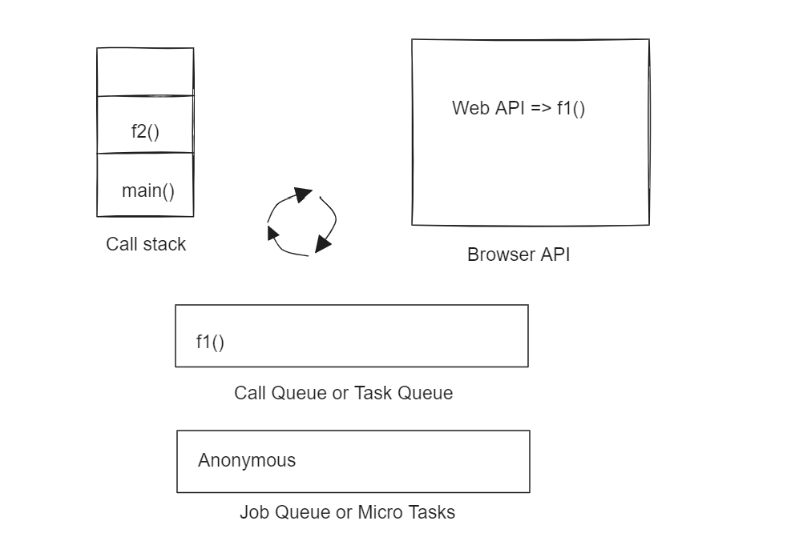

# Front-end-roadmap

This repository is for learning the Front-end concepts.

# 1. Concurrent React

- What is Concurrent React?

Its new behind-the-scenes mechanism that enables React to prepare multiple versions of your UI at the same time.

A key property of Concurrent React is that rendering is interruptible. This is introduced in React v18.0.0, before this version updates are rendered in a single, uninterrupted, synchronous transaction. With synchronous rendering, once the updates starts rendering, nothing can interrupt until the user see the results on the screen.

In a concurrent render, this was not always the case. React may start rendering an update, stops it in the middle ,then continue later. it may even abandon an in-progress render altogether. React guarantees that the UI will appear consistent even if a render is interrupted.To do this, it waits to perform DOM mutations until the end, once the entire tree has been evalutated. With this capability, React can prepare new screens in the background without blocking the main thread. This means UI can respond immediately to the user inputs even if it is in the middle of large rendering task,creating a fluid user experience.

Another example is reusable state. Concurrent React can remove the sections of the UI from the screen, then add them back later while reusing the previous state. For example, when the user tabs away from the screen and back, React should be able to restore the previous screen in the same state as it was in before.

# 2. React Suspense

Before deep diving into React Suspense lets know about Data fetching patterns

- Data fetching patterns
 a. Fetch on Render:
    This is most used way of data fetching.
    

 Problem: Consider parent and child components makes network calls on mounting phase, if the network call in the parent component fails during the component mount, it never allows the child component to render( Network waterfall ).

 b. Fetch then Render:
    
    Here we solve Network waterfall issue.

   Problem: Consider if the Parent component makes multiple network calls, children components render will wait till all the network calls to be resolved.

 c. Render while fetch: React Suspense.
    Before getting into the React Suspense lets understand what is Imperative and Declarive Programing.

   Imperative: You tell what needs to be done and how it needs to be done.
   example: Java, C, Pascal etc..
    
   Declarative: You tell the program that what needs to be done in declarative way and the program will take care of it.
   example: React - you dont need to worry about DOM manipulations. React Suspense is another example, ML
    
   React Suspense:
      a. We dont need to matain loading state.
      b. We dont need to make network call on the component mount using useEffect.
        
   Syntax:
   ```
        <Suspense fallback={<p> Loading... </p>}>
         <YourComponent/>
        </Suspense>
   ```
   Suspense will show the "Loading..." on the UI till the YourComponent network calls get resolved. Once it is resolved it will show the corresponding response(depending on the how you are rendering in YourComponent).

   Error boundary:
      In the above code snippet if the network call of the YourComponent fails with the error, to display any error response, we can use the Error boundary.

   We can have a generic error page cin the project and use it to display when network calls fails or throws error.

   We can use 3rd party library "react-error-boundary" in the project to do the same.

   Suspense will always reach out to the nearer error boundary when the component's network fails or throws error.


   project: https://github.com/NagarjunShroff/react-suspense

# 3. React Server Components

   React Server Compoenents (RSC) allows you to write the UI that can be rendered and optionally cached on the server.

   - What are all the thing to be keep in mind while writing RSC

      Basically if the components needs only data to display and does not need any user interactions, state management, Effect management, browser API's - these components are best suitable to be Server Components.

   - Advantages
      1. Needs backend access without roundtrip (No latency)
      2. No waterfalls.
      3. Automatic code splitting.
      4. Zero bundle size.
      5. An RSC can import and render the client compoenent, but reverse is not possible. However you can pass the RSC as props to client component.
      6. Use client components as much as possible at the leaf level and server components in the root level.

   - Limitations
      Server components does not have access to event handlers like click handler, client states and effects.

   - Importance of Server Compoenents
      1. Data fetching:
            Server Components allows you to move the data fetching logic to the server (nearer to the data source), so it takes less time to resolve the request. This will improve the performance by reducing the time.

      2. Security:
            Server Components allows you to move the sensitive data or logic to deal with tokens and API keys to server without taking the risk of exposing them to the client.

      3. Caching:
            By rendering on the server, results can be cached and reused on subsequest request and across users, so that it improves the performace by not querying frequesntly.

      4. Bundle size:
            By rendering on the server, all the dependencies does not to be dowloaded in the client side which make the page to render faster.

      5. Initial page lod and First Contentful Paint (FCP):
            Server components allows you to generate the HTML on the server and make it availble for the user immediately, without waiting for the client to download, parse and execute the javaScrpt to render the page.

      6. Search Engine Optimization and Social Networking Sharebility:
            Rendered HTMl on the server can be used by the search engine bots to idex the page and social network bots to create social card preview for the page.

      7. Streaming:
            Server components allows you to split the rendering work into chunks and stream it to client as in when it is ready. This allows the user to see certain parts of the UI without waiting for the entire UI to be ready on the server.

# 4. JavaScript Synchronous and Asyncchronous programing

   - JavaScript: An Single threaded, Non-blocking, Asynchronous, Concurrent programming language with lots of flexibility.

   - Synchronous: Everything what happens inside the Function Execution Stack(Call Stack) is sequential. This is the synchronous part of JavaScript.

   JavaScript's single thread make sure taking care of everything inside Function Execution Stack before it looks into anything else.

   Example 
   ```
   function f1() {
      console.log("f1");
   };

   function f2(){
      console.log("f2");
   };

   function f3(){
      console.log("f3");
   }

   f1();
   f2();
   f3();

   Output:
   f1
   f2
   f3
   ```


   - Asynchronous: Not occuring at the same point.

   - Usecases for Asychronous programing
      1. Fetching data from the server.
      2. Want to execute something with a delay.
      3. Want to execute something after an event.
   
   - Majority of the time asychronous programing comes into picture
      1. Browser APIs or Web APIs
      2. Promises - An unique javascript object that allows to do asynchronous operations.

   Example 1:
   ```
   function f1(){
      console.log("f1");
   };

   function f2(){
      console.log("f2");
   };

   function main(){
      console.log("main");

      setTimeout(f1, 0);

      f2();
   }

   main();

   Output:
   main
   f2
   f1
   ```
   1. Main() gets invoked and "main" will get printed.
   2. SetTimeout is the Browser API, f1() call back will gets into call queue.
   3. f2() gets in the stack and gets executes - which prints "f2".
   4. Nothing in the execution stack, event loop indentifies and moves f1() callback to the execution stack and that gets executed.


   
   Example 2:
   ```
   function f1(){
      console.log("f1");
   };

   function f2(){
      console.log("f2");
   };

   function main(){
      console.log("main");

      setTimeout(f1, 0);

      new Promise(function(resolve, reject){
         console.log("I'm a promise");
      }).then(result => result);

      f2();
   }

   Output:
   main
   f2
   I'm a promise
   f1
   ```
   1. main() gets invoked and prints "main".
   2. SetTimeout is an browser API, f1() call back will gets added in the call queue.
   3. Promise executor function will gets added into Job queue.
   4. f2() will gets into execution statck and gets executed.
   5. Nothing in the execution stack, Job queue gets higher precedence over call queue, Anonymous function(promise executor function) will be pushed to execution queue and gets executed.
   6. Execution stack is empty and f1() will be pushed to execution stack and gets executed.

Note: Job queue is always have higher precedence over Call queue.



# 5. Promises - How to Resolve or Reject a Promise.

   Promise: An Object represents an eventual completion or failure of an asynchronous operations and its resulting value.

   Example:
   ```
   Resolved promise.

   const promise1 = new Promise(function(resolve, reject){
      resolve('Water');
   });

   Rejected promise.

   const promise2 = new Promise(function(resolve, reject){
      reject(new Error("Disaster!"));
   });
   ```

   Promise takes an exector function as parameter which can have deciding factor to resolve or reject it.

   - Promise has 3 different states.
      1. pending: When the exection starts.
      2. fullfilled: When the promise gets resolved.
      3. rejected: When the promise gets rejected.

   - Promise can have 3 different values based on the state.
      1. undefined: When promise is in pending state, not fulfilled or rejected.
      2. value: When the promise gets resolved.
      3. error: When the promise gets rejected.

   - Promise provides 3 method handlers.
      1. .then()
      2. .catch()
      3. .finally()

   Example:
   ```
   const promise = new Promise(function(resolve, reject){
       resolve('Water');
       //reject(new Error("Jack fell down"));
   });

   const consumer = promise.then((result) => 
   console.log(`Cooking with ${result}.`)
   ).catch((error) => 
   console.log(`OMG ${error.message}.`));

   consumer();

   Output:
   if promise gets resolved the output will be: Cooking with Water.
   if promise gets rejected the output will be: OMG Jack fell down.
   ```

# 6. Callback

   Callback is a function which is to be executed after another function has finished execution.

   example:


   ```
   // Robin's end on clicking order pizza button
   orderPizza("veg", "cheese barbeque", (msg) => console.log(msg));

   // PizzaHub's end

   const orderPizza = (type, name, callback) => {
      console.log(`Pizza ${type} ${name} is ordered!`);

      setTimeout(() => {
         const msg = `Pizza ${type} ${name} is ready!!!`;
         callback(msg);
      }, 3000);
   }
   
   Output:
   Pizza veg cheese barbeque is ordered!

   (after 3 secs)
   Pizza veg cheese barbeque is ready!!!

   ```