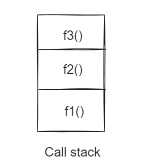
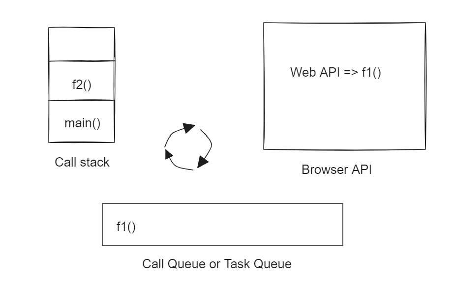
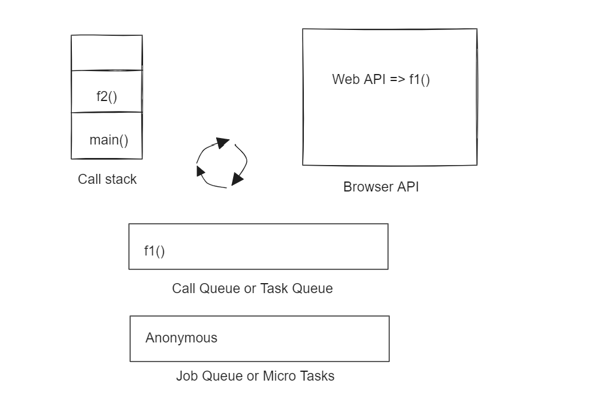

# JavaScript Synchronous and Asynchronous programing

   - JavaScript: An Single threaded, Non-blocking, Asynchronous, Concurrent programming language with lots of flexibility.

   - Synchronous: Everything what happens inside the Function Execution Stack(Call Stack) is sequential. This is the synchronous part of JavaScript.

   JavaScript's single thread make sure taking care of everything inside Function Execution Stack before it looks into anything else.

   Example 
   ```
   function f1() {
      console.log("f1");
   };

   function f2(){
      console.log("f2");
   };

   function f3(){
      console.log("f3");
   }

   f1();
   f2();
   f3();

   Output:
   f1
   f2
   f3
   ```


   - Asynchronous: Not occuring at the same point.

   - Usecases for Asychronous programing
      1. Fetching data from the server.
      2. Want to execute something with a delay.
      3. Want to execute something after an event.
   
   - Majority of the time asychronous programing comes into picture
      1. Browser APIs or Web APIs
      2. Promises - An unique javascript object that allows to do asynchronous operations.

   Example 1:
   ```
   function f1(){
      console.log("f1");
   };

   function f2(){
      console.log("f2");
   };

   function main(){
      console.log("main");

      setTimeout(f1, 0);

      f2();
   }

   main();

   Output:
   main
   f2
   f1
   ```
   1. Main() gets invoked and "main" will get printed.
   2. SetTimeout is the Browser API, f1() call back will gets into call queue.
   3. f2() gets in the stack and gets executes - which prints "f2".
   4. Nothing in the execution stack, event loop indentifies and moves f1() callback to the execution stack and that gets executed.


   
   Example 2:
   ```
   function f1(){
      console.log("f1");
   };

   function f2(){
      console.log("f2");
   };

   function main(){
      console.log("main");

      setTimeout(f1, 0);

      new Promise(function(resolve, reject){
         console.log("I'm a promise");
      }).then(result => result);

      f2();
   }

   Output:
   main
   f2
   I'm a promise
   f1
   ```
   1. main() gets invoked and prints "main".
   2. SetTimeout is an browser API, f1() call back will gets added in the call queue.
   3. Promise executor function will gets added into Job queue.
   4. f2() will gets into execution statck and gets executed.
   5. Nothing in the execution stack, Job queue gets higher precedence over call queue, Anonymous function(promise executor function) will be pushed to execution queue and gets executed.
   6. Execution stack is empty and f1() will be pushed to execution stack and gets executed.

Note: Job queue is always have higher precedence over Call queue.

